<p align="center">
  <a href="https://urml.dev"></a>
</p>

<p align="center">
  A small, opinionated, human-readable language for describing robot intent.
</p>

<p align="center">
  <a href="https://urml.dev"><b>urml.dev</b></a>
</p>

<p align="center">
  <a href="LICENSE"></a>
  <a href="https://www.python.org/"></a>
  <a href="https://pypi.org/project/urml-validator/"></a>
  <a href="docs/launch/claims-audit.md"></a>
  <a href="conformance/"></a>
  <a href="docs/rfcs/"></a>
</p>

---

# URML — Universal Robot Language

**One vocabulary for robot intent. Statically validated. Runs on any substrate.**

URML sits above existing robot operating systems (ROS 2, PX4, OPC UA Robotics, vendor SDKs) and lets humans, large language models, and robots share one vocabulary for *what should happen* — independent of which motors, joints, or frames carry it out. Every URML program is statically verified against the robot's declared capabilities, the active safety envelope, and the deployment's compliance policy **before a single actuator moves**.

URML is a **specification** and a set of **reference implementations**, not a robot operating system. The specification is Apache 2.0 — see [`CORE_COMMITMENT.md`](CORE_COMMITMENT.md) for what will always remain so.

---

## Try it in three commands

URML v0.1.0 ships on PyPI. Install the validator and the hermetic mock runtime, scaffold a starter project, validate it. About 30 seconds; no API key, no robot.

```bash
pip install urml-validator urml-ros2-runtime urml-llm-bridge
urml init my-robot --profile home && cd my-robot
urml validate program.urml.yaml \
    --manifest manifest.yaml --envelope envelope.yaml --profile home
```

<p align="center">
  <a href="docs/demos/sentence-to-motion.md"></a>
</p>

<p align="center">
  <sub>The sentence-to-motion loop, animated. One English sentence becomes a validated URML program becomes an executed trace, on a hermetic mock (no actuator moved). Every line above is real <code>urml</code> output (asserted in CI). <a href="docs/demos/sentence-to-motion.md">full walkthrough</a>.</sub>
</p>

`pip install` brings down the validator CLI and a hermetic mock runtime. `urml init` scaffolds a minimal project on disk (manifest, envelope, sample program with its natural-language prompt, Makefile). `urml validate` runs all five passes (argument typing → capability → safety envelope → variable bindings → compliance policy). The bundled US-federal default policy is on by default; pass `--no-policy` to skip it, or `--policy <your_file.yaml>` to use your own.

`--profile home`, `--profile drone`, `--profile industrial`, and `--profile warehouse` are all supported by `urml init`. See [`docs/demos/sentence-to-motion.md`](docs/demos/sentence-to-motion.md) for the full sentence-to-execution walkthrough behind the animation above, and [`docs/demos/compliance-walkthrough.md`](docs/demos/compliance-walkthrough.md) for a 90-second walkthrough that shows the compliance pass rejecting a covered-foreign-country component manifest, and the override path.

### From source (hack on URML itself)

```bash
git clone https://github.com/URML-MARS/URML.git && cd URML
python bootstrap.py     # creates .venv, installs all 5 packages editable, in order
make test               # → 765 passed + 28 gated-skipped
make demo-run           # → the animation above, reproduced live on the mock
```

`make demo` (validate only) and `make demo-run` (validate + execute) walk through the same flow with the canonical red-mug example. `make help` lists the rest (`install-dev`, `audit`, `demo-record`, `clean`).

---

## What URML gives you

Every `✅` below maps to a shipped file and a passing test or recorded CI run — see [`docs/launch/claims-audit.md`](docs/launch/claims-audit.md). Test counts are measured, not estimated (re-measured 2026-05-20, partial re-run 2026-05-22 via `make audit`: **765 passed + 28 gated-skipped** across 16 packages).

| Capability | State |
|---|---|
| **Five-pass static validator** — argument typing, capability checks, safety-envelope tightening (incl. geofence, 3D altitude bands, people-occupancy zones), variable-binding + cross-primitive type analysis, compliance policy | ✅ Implemented, 242 unit tests |
| **20 primitives** — the 12 core (`move_to`, `dock`, `hover`, `wait`, `wait_for`, `grasp`, `release`, `detect`, `scan`, `measure`, `capture`, `report`) plus 8 profile-extensions across home (`speak`, `listen`), drone (`take_off`, `land`, `return_to_home`), and industrial (`pick_from`, `place_at`, `swap_tool`) | ✅ Validator + reference-runtime executors for all 20 |
| **Compliance enforcement** — provenance schema on the manifest, a pluggable YAML policy DSL, and a bundled US-federal default policy (NDAA §889 / FY26, FCC Covered List, EO 14307, ASRA) | ✅ Implemented; `--no-policy` opt-out |
| **LLM bridge** — provider-agnostic (Anthropic + OpenAI + EchoProvider); revision loop with policy-error short-circuit; home / drone / industrial few-shots | ✅ 77 unit tests |
| **Conformance suite** — declarative YAML fixtures any URML-compatible runtime must pass; runnable via `urml conformance run`; the runtime contract is normatively defined in [RFC-0014](docs/rfcs/0014-substrate-conformance.md) | ✅ 101 fixtures (home, drone, industrial, biped, quadruped, mobile, warehouse, marine, educational, research) |
| **CLI** — `urml validate`, `urml execute`, `urml schema`, `urml translate`, `urml emit-prompt`, `urml init`, `urml conformance run` | ✅ All seven subcommands |
| **Mock reference runtime** — hermetic execution without a robot, used by the conformance suite | ✅ Implemented |
| **Real ROS 2 adapter** (`RclpyAdapter`) — full ROSAdapter Protocol via `rclpy` (Nav2 / MoveIt 2 / vision_msgs) | ✅ Implemented; the `gazebo-e2e` job (live TurtleBot 4 + Nav2 sim) passed ×3 — [job-level, badge caveat explained](docs/launch/claims-audit.md) |
| **PX4 / MAVLink reference runtime** (`PX4Adapter`) — full Protocol via `pymavlink`, no ROS dependency | ✅ Implemented |
| **CompositeAdapter** — one URML program across two substrates: PX4 flight + a ROS 2 companion, per-method routing | ✅ Implemented |
| **Twelve further reference runtimes** — `marine` (BlueROV2/ArduSub), `industrial-arm` (ABB/FANUC/KUKA/YASKAWA/UR/Franka/Kawasaki/Stäubli/Comau/Mitsubishi/Denso/Hyundai/Nachi/Epson/Omron/Hanwha = 16 brands), `legged` (Spot/ANYmal), `humanoid` (Digit), `mobile` (Husky/Jackal), and the zero-ROS `opcua` (OPC UA Robotics), `cobot` (8 brands: UR/Franka/Doosan/Techman/Kinova/Mecademic/Neura/Kassow native SDKs), `mujoco` + `isaac` (NVIDIA Sim/Lab, local RTX host) sims, `embedded` (micro:bit/Arduino serial), `edu` (VEX/LEGO SPIKE/Thymio), `autosar` (RFC-0019 scaffold) | ✅ Hermetic suites green; live e2e is gated CI (calibration-staged, **not** a hardware claim) — see [audit](docs/launch/claims-audit.md). Autoware ships **manifest+spec only** pending RFC-0020. |

---

## Regulatory alignment

URML's default validator policy aligns with **United States federal robotics and uncrewed-systems regulation**:

- NDAA Section 889 and FY26 NDAA procurement restrictions
- FCC Covered List (DJI, Autel, etc.) effective 2025-12-23
- Executive Order 14307 ("Unleashing American Drone Dominance")
- The American Security Robotics Act once enacted

Deployments outside the US can override the default with `urml validate --policy <file.yaml>`, or disable the compliance pass entirely with `--no-policy`. The mechanism is regulation-neutral; the bundled default is US-aligned by design.

See [RFC-0003](docs/rfcs/0003-us-alignment.md) for the strategic decision and trade-offs accepted; [RFC-0004](docs/rfcs/0004-compliance-policy.md) for the technical mechanism; [`spec/layer-1-hal/policy.md`](spec/layer-1-hal/policy.md) for the normative policy file format.

---

## Architecture in one diagram

```
┌──────────────────────────────────────────────────────────────────┐
│  Layer 4: Natural Language → URML                                 │
│  LLM bridge: provider-agnostic, prompt contract, revision loop    │
├──────────────────────────────────────────────────────────────────┤
│  Layer 3: Behavior Composition                                    │
│  sequence · branch · parallel · retry · on_error                  │
├──────────────────────────────────────────────────────────────────┤
│  Layer 2: Intent Primitives                                       │
│  12 core + home (speak / listen) + drone (take_off / land / RTH)  │
│  + industrial (pick_from / place_at / swap_tool)  [RFC-0013]      │
├──────────────────────────────────────────────────────────────────┤
│  Layer 1: Hardware Abstraction Layer                              │
│  capability manifest + provenance + safety envelope               │
├──────────────────────────────────────────────────────────────────┤
│  Layer 0: Substrate (NOT part of URML)                            │
│  ROS 2 · PX4 / MAVLink · OPC UA · KUKA · ABB · IEC 61131-3 · ...  │
└──────────────────────────────────────────────────────────────────┘

  Validation pipeline (runs before any actuator):
  Pass 1 → Pass 2 → Pass 3 → Pass 4 → Pass 5
  args     caps      envelope binding   compliance policy
```

---

## Status

**Phase 1 (public)** — as of v0.1.0 (2026-05-22). External code contributions are open per [`CONTRIBUTING.md`](CONTRIBUTING.md); the RFC process governs spec changes. The author remains the sole maintainer — the phase flip opens the door; it does not assert contributors have arrived. The artifact under review is the manifesto plus the v0.1 implementation; the decision history is in [`docs/rfcs/`](docs/rfcs/).

What works today is what the table above lists as `✅`. What's planned is in [`MANIFESTO.md`](MANIFESTO.md) §Roadmap Snapshot. The decision history is in [`docs/rfcs/`](docs/rfcs/); seven RFCs are filed and accepted (0001–0007).

---

## Start here

| You want to... | Read this |
|---|---|
| Get URML running in under an hour | [Tutorial 1: Getting started](docs/tutorials/01-getting-started.md) |
| See one English sentence become an executed program | [Sentence-to-motion walkthrough](docs/demos/sentence-to-motion.md) |
| See an LLM's unsafe program get refused before takeoff | [Safety-rejection walkthrough](docs/demos/safety-rejection.md) |
| See compliance enforcement in action | [Compliance walkthrough](docs/demos/compliance-walkthrough.md) |
| Understand the strategic case | [`MANIFESTO.md`](MANIFESTO.md) |
| Understand the design decisions | [`docs/rfcs/`](docs/rfcs/) (RFC-0002 for primitives; 0003 for US alignment; 0004 for compliance) |
| Write a URML program | [Tutorial 2: Anatomy of a URML program](docs/tutorials/02-anatomy-of-a-program.md) |
| Author a capability manifest | [Tutorial 4: Writing your own manifest](docs/tutorials/04-writing-your-own-manifest.md) |
| Connect URML to an LLM | [Tutorial 3: Natural language to URML](docs/tutorials/03-natural-language-to-urml.md) |
| Understand governance and the open-source posture | [`GOVERNANCE.md`](GOVERNANCE.md), [`CORE_COMMITMENT.md`](CORE_COMMITMENT.md) |
| Understand how URML is authored | [`VIBE.md`](VIBE.md) |
| Contribute (Phase 1+) | [`CONTRIBUTING.md`](CONTRIBUTING.md) |
| List your runtime in the registry | [`docs/registry/SUBMISSION.md`](docs/registry/SUBMISSION.md) |
| Browse runtimes that report URML compatibility | [`docs/compatible-runtimes.md`](docs/compatible-runtimes.md) |
| Position a robot for URML and federal-procurement readiness | [`docs/manufacturers/README.md`](docs/manufacturers/README.md) |
| List a robot or product in the manufacturer directory | [`docs/manufacturers/SUBMISSION.md`](docs/manufacturers/SUBMISSION.md) |
| Ask a question, show what you built, or give feedback | [GitHub Discussions](https://github.com/URML-MARS/URML/discussions) |
| Report a security issue | [`SECURITY.md`](SECURITY.md) |

---

## Community & support

URML uses [GitHub Discussions](https://github.com/URML-MARS/URML/discussions) as its public question and feedback channel:

- [Q&A](https://github.com/URML-MARS/URML/discussions/categories/q-a) — how do I write a manifest, run the validator, integrate a runtime.
- [Ideas](https://github.com/URML-MARS/URML/discussions/categories/ideas) — pre-RFC ideas for primitives, profiles, or tooling; the front of the funnel that leads to a primitive-proposal issue and then an RFC.
- [Builders & Makers](https://github.com/URML-MARS/URML/discussions/categories/builders-makers) — runtime authors and manufacturers: conformance, the registry, the directory, the federal-validation self-report.
- [Show and tell](https://github.com/URML-MARS/URML/discussions/categories/show-and-tell) — what you built on URML.
- [General](https://github.com/URML-MARS/URML/discussions/categories/general) — everything else, including complaints and critique of the strategic posture.

Issues are scoped to reference-runtime bugs and the primitive-proposal funnel. Security and conduct concerns follow the private process in [`SECURITY.md`](SECURITY.md), never a public thread.

Critique of the primitive vocabulary, the layer boundaries, and the strategic posture, pointers to prior art, and use cases that strain the current architecture are all welcome. See [`CONTRIBUTING.md`](CONTRIBUTING.md) for the full routing.

---

## Compatible Runtimes

If you build a runtime that translates URML into a substrate (ROS 2, PX4, vendor SDK, anything else), you can self-report compatibility by running the public conformance suite and opening a PR. See [`docs/registry/SUBMISSION.md`](docs/registry/SUBMISSION.md) for the five-step flow, [`docs/compatible-runtimes.md`](docs/compatible-runtimes.md) for the current entries, and [`TRADEMARK.md`](TRADEMARK.md) for what listing does and does not grant. The registry is free and opt-in. There is no URML-Certified mark in use yet; that is a Phase 4 program.

If instead you **make robots or parts** rather than runtimes, see [`docs/manufacturers/README.md`](docs/manufacturers/README.md). It covers the integration path, an optional factual federal-validation self-report, and the self-reported [manufacturer directory](docs/manufacturers/directory.md). Same posture: free, opt-in, no mark, not a certification.

---

## Authoring

URML is the invention of Ido Yahalomi. The spec text, the four reference runtimes, the validator, the conformance suite, and the outreach RFC log are AI-assisted (vibe-coded) under the maintainer's direction and review. See [`VIBE.md`](VIBE.md). The work-product discipline (tests, conformance fixtures, audit, DCO, Apache 2.0) is unchanged.

---

## License

Apache License 2.0. See [`LICENSE`](LICENSE). Contributions require a [Developer Certificate of Origin](DCO) sign-off — `git commit -s` adds the required line. See [`CONTRIBUTING.md`](CONTRIBUTING.md) for the engagement details and [`CORE_COMMITMENT.md`](CORE_COMMITMENT.md) for what stays Apache 2.0 forever.

This project follows the [Contributor Covenant v2.1](CODE_OF_CONDUCT.md) Code of Conduct.
