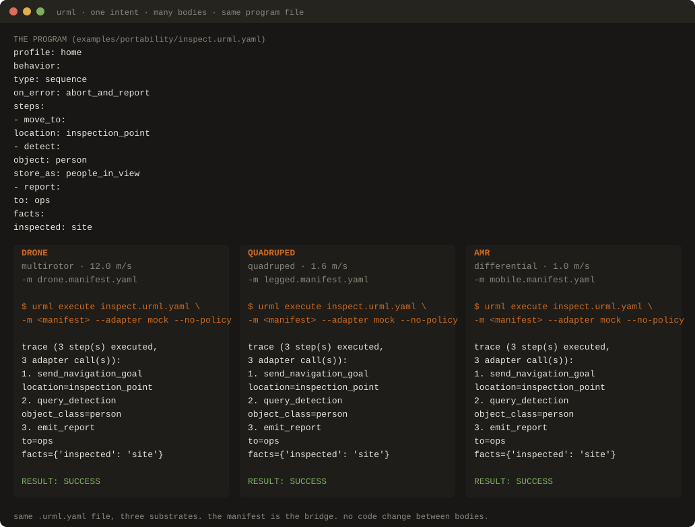

<p align="center">
  <a href="https://urml.dev"></a>
</p>

<p align="center">
  A small, opinionated, human-readable language for describing robot intent.
</p>

<p align="center">
  <a href="https://urml.dev"><b>urml.dev</b></a>
</p>

---

# One intent, many bodies: the same URML program on three substrates

The sentence-to-motion demo answers "what is URML." This one answers
"what does *universal* mean." One URML program file — three primitives,
core vocabulary, `home` profile — is validated and executed against three
distinct body manifests: a multirotor, a quadruped, and a differential
AMR. The program file is not edited between runs. The manifest is the
bridge.

Useful for: the second thing to show someone after they have seen
sentence-to-motion. It is substrate independence as a verifiable
artifact, not a claim.

<p align="center">
  
</p>

<p align="center">
  <sub>Same <code>.urml.yaml</code> file, three substrates. Every trace line is real <code>urml execute</code> output, asserted in CI against each of the three manifests.</sub>
</p>

## Prerequisites

- URML installed from a checkout per [Tutorial 1](../tutorials/01-getting-started.md).
- A terminal, `cd` into the URML repository root.

## The program

```yaml
profile: home
behavior:
  type: sequence
  on_error: abort_and_report
  steps:
    - move_to:
        location: inspection_point
    - detect:
        object: person
        store_as: people_in_view
    - report:
        to: ops
        facts:
          inspected: site
```

Three primitives, core vocabulary only: `move_to`, `detect`, `report`.
The program is body-agnostic on purpose. It lives at
[`examples/portability/inspect.urml.yaml`](../../examples/portability/inspect.urml.yaml).

## The three bodies

Each manifest declares the same logical location, `inspection_point`,
at a body-appropriate pose. Each declares a camera that supports photo
and a `person` object class in its vocabulary. What differs is the
`mobility.drive_type` (and frames, max velocity, station-keeping
behavior) — that is, the actual robot class.

| Body | `drive_type` | Manifest |
|---|---|---|
| Multirotor (drone) | `multirotor` | [`drone.manifest.yaml`](../../examples/portability/drone.manifest.yaml) |
| Quadruped (Spot-class) | `quadruped` | [`legged.manifest.yaml`](../../examples/portability/legged.manifest.yaml) |
| Differential AMR (Husky-class) | `differential` | [`mobile.manifest.yaml`](../../examples/portability/mobile.manifest.yaml) |

## Run it

Three commands, one per body, same program file each time:

```bash
urml execute examples/portability/inspect.urml.yaml \
    -m examples/portability/drone.manifest.yaml \
    --profile home --no-policy --adapter mock

urml execute examples/portability/inspect.urml.yaml \
    -m examples/portability/legged.manifest.yaml \
    --profile home --no-policy --adapter mock

urml execute examples/portability/inspect.urml.yaml \
    -m examples/portability/mobile.manifest.yaml \
    --profile home --no-policy --adapter mock
```

Each prints the same trace, because the `mock` adapter is substrate-neutral:

```
  trace (3 step(s) executed, 3 adapter call(s)):
   1. send_navigation_goal  location=inspection_point
   2. query_detection  object_class=person
   3. emit_report  to=ops facts={'inspected': 'site'} status=success severity=info

  RESULT: SUCCESS (3 step(s) executed)
```

## What this proves

Each of those three runs took the program through the full validator
(argument typing, capability check against the body's manifest, safety
envelope, variable bindings) before the executor dispatched any
primitive. A program that named a primitive the manifest did not declare
would be refused at Pass 2 — that is the point of the manifest. So
"the same program validated and executed against three different bodies"
is not a claim that the trace text differs; it is a claim that the
*capability contract* differs, body to body, and the program satisfies
all three.

For body-specific execution (a real PX4 flight controller, a real
SpotAdapter, a real HuskyAdapter), see the substrate runtimes under
[`reference/`](../../reference/). Each implements the same
`ROSAdapter` Protocol the mock satisfies. The portability story is the
same; only the dispatch target changes. The cross-substrate routing
*within one robot* (PX4 flight controller + ROS 2 companion, one
program) lives in [`reference/px4-runtime/src/urml_px4_runtime/composite.py`](../../reference/px4-runtime/src/urml_px4_runtime/composite.py).

## What this is NOT

The `mock` adapter is a mock. It is labeled `HERMETIC MOCK` in its own
output. No actuator moved on any of the three runs. Each body's
*hermetic mock suite* under [`reference/`](../../reference/) is what
backs the per-body runtime claim; this asset is the language-layer
portability claim — one program file, three valid capability contracts,
three successful executions.

This walkthrough is illustrative. A real deployment uses a real robot's
manifest, a real safety envelope, and the compliance pass left on.

## Files used in this walkthrough

- [`examples/portability/inspect.urml.yaml`](../../examples/portability/inspect.urml.yaml): the program.
- [`examples/portability/drone.manifest.yaml`](../../examples/portability/drone.manifest.yaml): multirotor body.
- [`examples/portability/legged.manifest.yaml`](../../examples/portability/legged.manifest.yaml): quadruped body.
- [`examples/portability/mobile.manifest.yaml`](../../examples/portability/mobile.manifest.yaml): differential-AMR body.
- [`docs/assets/one-intent-many-bodies.svg`](../assets/one-intent-many-bodies.svg): the rendered comparison (generated, byte-asserted in CI).
- [`tools/scripts/gen_portability_svg.py`](../../tools/scripts/gen_portability_svg.py): the SVG generator (pure stdlib, deterministic).
- [`reference/validator/tests/test_portability_svg.py`](../../reference/validator/tests/test_portability_svg.py): the guard test (every trace line is asserted against a live hermetic run per body).

## Related reading

- [Sentence to motion](sentence-to-motion.md): one English sentence becomes one validated program becomes one executed trace.
- [Sentence to flight](sentence-to-flight.md): the same loop, against a real simulated autopilot (PX4 SITL).
- [Compliance walkthrough](compliance-walkthrough.md): the fifth validator pass (US-federal default policy) this demo skips with `--no-policy`.
